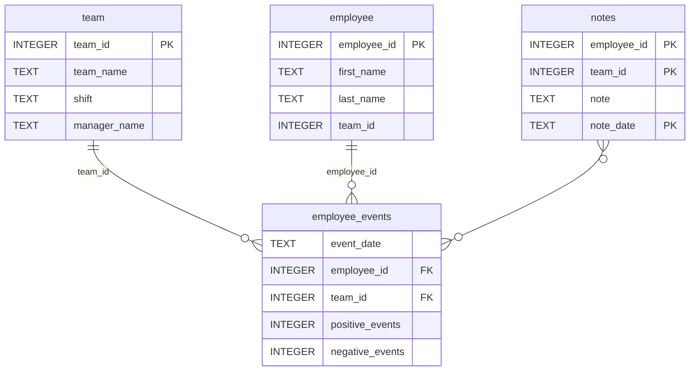

# Software Engineering for Data Scientists

This repository contains starter code for the **Software Engineering for Data Scientists** chapter project. 

## Project Overview

This project builds a dashboard for managers to monitor employee performance and recruitment risk, using a SQLite database and a machine learning model.

## Setup Instructions

1. **Clone the repository**
    ```sh
    git clone <repo-url>
    cd dsnd-dashboard-project
    ```

2. **Create and activate a virtual environment**
    ```sh
    python -m venv dsnd_dash
    .\dsnd_dash\Scripts\activate  # Windows
    # or
    source dsnd_dash/bin/activate  # Mac/Linux
    ```

3. **Install dependencies**
    ```sh
    pip install -r requirements.txt
    ```

4. **Install the Python package**
    ```sh
    pip install -e python-package
    ```
    Or, to install from a source distribution:
    ```sh
    cd python-package
    python setup.py sdist
    pip install dist/employee_events-<version>.tar.gz
    ```

## Usage

- **Run the dashboard**
    ```sh
    cd report
    python dashboard.py
    ```

- **Run tests**
    ```sh
    pytest
    ```

## Notes

- The SQLite database (`employee_events.db`) is in `python-package/employee_events/`.
- All main code is in `python-package/employee_events/` and `report/`.
- The machine learning model is in `assets/model.pkl`.
- No special environment variables are needed.

## Requirements

All dependencies are listed in `requirements.txt` at the project root.

## References

Course notes and videos from the Udacity Nanodegree Data Scientist: Course 3 Software Engineering were 
used as references for this project.

---

### Repository Structure
```
├── README.md
├── assets
│   ├── model.pkl
│   └── report.css
├── env
├── python-package
│   ├── employee_events
│   │   ├── __init__.py
│   │   ├── employee.py
│   │   ├── employee_events.db
│   │   ├── query_base.py
│   │   ├── sql_execution.py
│   │   └── team.py
│   ├── requirements.txt
│   ├── setup.py
├── report
│   ├── base_components
│   │   ├── __init__.py
│   │   ├── base_component.py
│   │   ├── data_table.py
│   │   ├── dropdown.py
│   │   ├── matplotlib_viz.py
│   │   └── radio.py
│   ├── combined_components
│   │   ├── __init__.py
│   │   ├── combined_component.py
│   │   └── form_group.py
│   ├── dashboard.py
│   └── utils.py
├── requirements.txt
├── start
├── tests
    └── test_employee_events.py
```

### employee_events.db



---

If you have any questions or run into issues, feel free to open an issue or reach out.